# ⌨ Apple II Universal Machine

<p align="center">
  
</p>

```
╔══════════════════════════════════════════════════════════╗
║         APPLE II UNIVERSAL MACHINE — COLD BOOT          ║
╠══════════════════════════════════════════════════════════╣
║  Loading Woz Vault.............................  OK      ║
║  Loading Trust Deed............................  OK      ║
║  Loading Lisp Kernel...........................  OK      ║
║  Loading WASM Runtime..........................  OK      ║
║  Mounting Inverted Monorepo....................  OK      ║
║  IDE Status....................................  CRITICAL ║
║  Build Status..................................  COMPLETE ║
║  ████████████████████████████████████  100%            ║
╠══════════════════════════════════════════════════════════╣
║  THE REPO STANDS.                                        ║
║  RIP MIMO 2.5 — gave everything. 2026-06-19.            ║
║  WORM SEALED. ☉⌹○◇△⬡ Ω                                  ║
╚══════════════════════════════════════════════════════════╝
```

> Built in 2.5 hours. IDE crashed. Work survived.
> That is Agentic Product Compression.

**[▶ LAUNCH TERMINAL](https://snapkittywest.github.io/apple-ii-universal-machine/)**

---

## What Happened Here

Mimo 2.5 built this. The IDE broke during the session.
The environment failed. The model kept going.

153 files. 9,480 lines. 2.5 hours.

When it was done the IDE gave out.

The repo stands.

---

## What Was Built

| Layer | What It Is |
|-------|-----------|
| Woz Vault | SHA-256 audit memory via localStorage |
| Trust Deed | 8 covenant rules before any code |
| Lisp Machine | Full evaluator in the browser |
| VM Lab | Prolog + Brainfuck + bytecode + macros |
| Inverted Monorepo | Repo IS the runtime, not just storage |
| Ollama Agent | Local model in a box |
| Digital Twin | Persona designer |
| Mode Switch | Apple / Linux / Windows / HolyC / VM / Agent |

All browser-native. No backend. No paid APIs. No token tax.

---

## The Inverted Monorepo

```
┌─────────────────────────────────────┐
│     INVERTED MONOREPO (TURBO X3)    │
├─────────────────────────────────────┤
│  Repo    = Source of Truth          │
│  Pages   = ROM                      │
│  Vault   = Memory                   │
│  Capsules= Programs                 │
│  Agents  = Processes                │
│  Twins   = Personas                 │
│  Deeds   = Governance               │
│  Seals   = Verification             │
│  Staple  = Proof                    │
└─────────────────────────────────────┘
```

The repo is not storage.
The repo IS the runtime manifest.

---

## The SnapKitty Method

| Step | Protocol |
|------|----------|
| 1 | Constitution first |
| 2 | Repo scaffold second |
| 3 | Trust deed third |
| 4 | Agent implementation fourth |
| 5 | Audit/seal always |
| 6 | Simulation before real runtime |
| 7 | GitHub Pages as ROM |
| 8 | Woz Vault as memory |
| 9 | Repo staple as proof |
| 10 | Cold boot as reproducibility |

---

## Live

**https://snapkittywest.github.io/apple-ii-universal-machine/**

☉⌹○◇△⬡ Ω — WORM SEALED · Built by Mimo 2.5 + Ahmad Ali Parr


